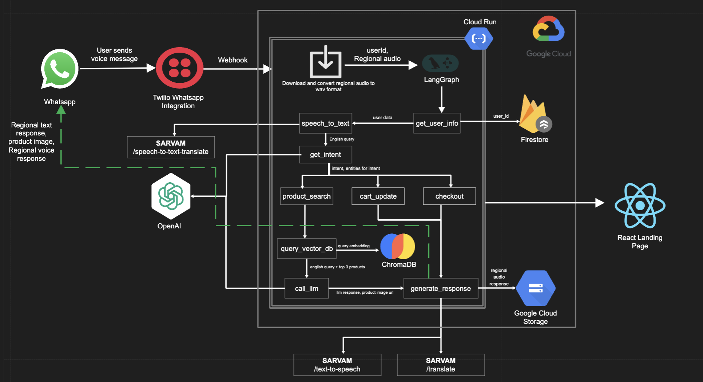

# IndicCommerce - Voice-Based Agentic Ecommerce in Regional Indian Languages

## Overview
IndicCommerce is an intelligent ecommerce application that enables users to interact with a shopping assistant via WhatsApp using voice messages in regional Indian languages. The app leverages Sarvam AI for speech processing, LangGraph for agent workflow, ChromaDB for vector search, Firestore for persistence, and Twilio for WhatsApp integration. It supports product search, conversation history, user preferences, and multilingual voice interactions through natural language processing.

## Features

- **WhatsApp Integration**: Receive and respond to user messages (including audio) via WhatsApp using Twilio.
- **Voice Input in Indian Languages**: Users can send voice messages in their preferred regional language.
- **Speech-to-Text & Text-to-Speech**: Uses Sarvam AI APIs for accurate speech recognition and synthesis.
- **Vector-Based Product Search**: ChromaDB-powered semantic search for finding relevant products.
- **User Data Persistence**: Firestore integration for storing user preferences and conversation history.
- **Product Catalog API**: REST API endpoints for product search and configuration.
- **Modular Agent Design**: Built with LangGraph for extensible, maintainable agent workflows.
- **Docker Support**: Full containerization with production-ready deployment.
- **Cloud Run Deployment**: Optimized for Google Cloud Platform deployment.
- **Robust Error Handling**: Comprehensive error handling across all components.

## Architecture



The system consists of the following components:

1. **WhatsApp Integration**: Handles incoming and outgoing WhatsApp messages using the Twilio API
2. **Speech Processing**: Transcribes voice messages to text using Sarvam AI's speech-to-text API
3. **Vector Search**: ChromaDB-powered semantic search for product discovery
4. **User Data Management**: Firestore integration for conversation history and user preferences
5. **LangGraph Agent**: Intelligent workflow management for conversational commerce
6. **Text-to-Speech**: Converts text responses back to audio using Sarvam AI
7. **Cloud Deployment**: Production-ready deployment on Google Cloud Platform

## Screenshots

### Indic Commerce in action

*An exchange between a user and the system*


## Project Structure

```
IndicCommerce/
├── app.py                          # Main Flask application entry point
├── requirements.txt                # Python dependencies
├── Dockerfile                      # Docker configuration
├── docker-compose.yml              # Docker-compose setup for development
├── .dockerignore                   # Docker build exclusions
├── docs/                           # Documentation and assets
│   ├── architecture_diagram.png    # System architecture diagram
│   └── screenshots/                # Application screenshots
│       └── product_search.png
├── static/                         # Static assets
│   └── audio/                      # Generated audio files
├── chroma_db/                      # ChromaDB vector database
├── debug_audio/                    # Debug audio files
├── iac/                            # Infrastructure as Code (Terraform)
│   ├── main.tf                     # Main Terraform configuration
│   ├── variables.tf                # Variable definitions
│   └── terraform.tfvars            # Variable values
├── src/                            # Source code
│   ├── agents/                     # LangGraph agents
│   │   └── ecom_agent.py           # Main ecommerce agent workflow
│   ├── data/                       # Data management
│   │   └── sample_products.py      # Product data and utilities
│   ├── db/                         # Database integrations
│   │   └── firestore.py            # Firestore client and operations
│   ├── llm/                        # Language model integrations
│   │   └── sarvam.py               # Sarvam AI API integration
│   ├── prompts/                    # LLM prompts
│   │   └── shopping_assistant.py   # Shopping assistant prompts
│   ├── speech_processing/          # Voice processing
│   │   └── processor.py            # Speech-to-text and TTS
│   ├── utils/                      # Utility modules
│   │   ├── ngrok.py                # ngrok integration
│   │   └── vector_store.py         # ChromaDB vector operations
│   └── whatsapp/                   # WhatsApp integration
│       └── webhook.py              # WhatsApp webhook handler
├── scripts/                        # Utility scripts
│   ├── generate_vector_store_persistence.py
│   └── test.py                     # Additional test script
└── tests/                          # Test cases
    ├── run_tests.py                # Test runner
    ├── test_app.py                 # Flask app tests
    ├── test_ecom_agent.py          # Agent workflow tests
    └── test_webhook.py             # WhatsApp webhook tests
```

## Setup Instructions

### Prerequisites

- Python 3.9 or higher
- Docker and Docker Compose (recommended for development)
- Google Cloud Platform account with Firestore and Cloud Run enabled
- Sarvam AI API key
- Twilio account with WhatsApp Business API access
- ngrok or similar tunneling service for local development

### Environment Setup

1. Clone the repository:
   ```bash
   git clone https://github.com/yourusername/IndicCommerce.git
   cd IndicCommerce
   ```

2. Create a `.env` file with your API keys and configuration:
   ```bash
   # Sarvam AI Configuration
   SARVAM_API_KEY=your_sarvam_api_key
   
   # Twilio Configuration
   TWILIO_ACCOUNT_SID=your_twilio_sid
   TWILIO_AUTH_TOKEN=your_twilio_token
   TWILIO_WHATSAPP_NUMBER=your_whatsapp_number
   
   # Google Cloud Configuration
   GOOGLE_APPLICATION_CREDENTIALS=path/to/service-account-key.json
   GCP_PROJECT_ID=your_gcp_project_id
   
   # Application Configuration
   ENV=local
   PORT=5000
   ```

3. Set up Google Cloud service account:
   ```bash
   # Download service account key from GCP Console
   # Place it in the project root as key.json
   export GOOGLE_APPLICATION_CREDENTIALS="$(pwd)/key.json"
   ```

### Running with Docker (Recommended)

1. Build and start the containers:
   ```bash
   docker-compose up --build
   ```

2. The application will be available at:
   - Main app: `http://localhost:5000`
   - API endpoints: `/get_config` and `/get_products`

### Running without Docker

1. Create and activate a virtual environment:
   ```bash
   python -m venv venv
   source venv/bin/activate  # On Windows: venv\Scripts\activate
   ```

2. Install dependencies:
   ```bash
   pip install -r requirements.txt
   ```

3. Run the application:
   ```bash
   python app.py
   ```

4. Expose your local server using ngrok:
   ```bash
   ngrok http 5000
   ```

### Cloud Deployment

Deploy to Google Cloud Run using Terraform:

1. Navigate to the infrastructure directory:
   ```bash
   cd iac
   ```

2. Initialize Terraform:
   ```bash
   terraform init
   ```

3. Create a `terraform.tfvars` file with your configuration:
   ```hcl
   project_id = "your-gcp-project-id"
   region = "asia-south1"
   image = "asia-south1-docker.pkg.dev/your-project/indic-commerce/indic-commerce:latest"
   sarvam_api_key = "your-sarvam-api-key"
   twilio_account_sid = "your-twilio-sid"
   twilio_auth_token = "your-twilio-token"
   twilio_whatsapp_number = "your-whatsapp-number"
   ```

4. Deploy the infrastructure:
   ```bash
   terraform plan
   terraform apply
   ```

## WhatsApp Business API Setup

1. Create a Twilio account and set up a WhatsApp Sandbox
2. Configure the sandbox webhook URL to point to your ngrok URL + `/webhook`, e.g., `https://your-ngrok-url.ngrok.io/webhook`
3. Test the integration by sending a message to your WhatsApp sandbox number

## User Flow

1. **User Sends Voice Message**: User sends a voice message in their preferred language asking for products via WhatsApp
2. **User Data Retrieval**: System fetches user preferences and conversation history from Firestore
3. **Speech-to-Text**: The system transcribes the voice message using Sarvam AI
4. **Vector Search**: ChromaDB performs semantic search to find relevant products
5. **LLM Processing**: LangGraph agent processes the query and generates contextual responses
6. **Response Generation**: The system creates appropriate text responses
7. **Text-to-Speech**: The response is converted to audio in the user's language using Sarvam AI
8. **WhatsApp Response**: Both text and audio responses are sent back to the user
9. **Data Persistence**: Conversation history and user interactions are stored in Firestore
10. **Continuous Learning**: The system learns from user interactions to improve recommendations

## Development Guide

### Testing the Application

1. **Local Development Server**:
   ```bash
   python app.py
   ```
   Visit `http://localhost:5000` to access the API

2. **API Testing**:
   - Test `/get_config` endpoint for configuration
   - Test `/get_products` endpoint for product search
   - Use query parameter `?query=search_term` for product search

3. **Voice Processing Testing**:
   - Use the WhatsApp sandbox to send voice messages
   - Check `debug_audio/` for processed audio files
   - Monitor logs for speech processing results

### Running Tests

```bash
# Run all tests
python tests/run_tests.py

# Run specific test files
python -m pytest tests/test_app.py
python -m pytest tests/test_ecom_agent.py
python -m pytest tests/test_webhook.py

# Run tests with coverage
python tests/run_tests_with_coverage.py
```

### Adding New Products

1. Update the product data in `src/data/sample_products.py`
2. Regenerate the vector store:
   ```bash
   python scripts/generate_vector_store_persistence.py
   ```

### Vector Store Management

- **Initialize**: Run the vector store generation script
- **Update**: Modify products and regenerate embeddings
- **Query**: Use the vector store utilities in `src/utils/vector_store.py`

### Firestore Integration

- **User Data**: Stored in `users` collection
- **Conversations**: Managed through the Firestore client
- **Configuration**: Set up through environment variables

### Extending the System

- **Adding Languages**: Update the speech processing module in `src/speech_processing/processor.py`
- **New Agent Nodes**: Add nodes to the LangGraph workflow in `src/agents/ecom_agent.py`
- **Enhanced Vector Search**: Improve embeddings and search in `src/utils/vector_store.py`
- **Custom Prompts**: Modify LLM prompts in `src/prompts/shopping_assistant.py`
- **New Product Categories**: Extend the product data structure in `src/data/sample_products.py`

## Deployment

### Production Deployment on Google Cloud

1. **Infrastructure Setup**:
   ```bash
   cd iac
   terraform init
   terraform plan
   terraform apply
   ```

2. **Build and Push Docker Image**:
   ```bash
   # Configure Docker for Artifact Registry
   gcloud auth configure-docker asia-south1-docker.pkg.dev
   
   # Build and push image
   docker build -t asia-south1-docker.pkg.dev/PROJECT_ID/indic-commerce/indic-commerce:latest .
   docker push asia-south1-docker.pkg.dev/PROJECT_ID/indic-commerce/indic-commerce:latest
   ```

3. **Deploy to Cloud Run**:
   ```bash
   gcloud run deploy indic-commerce \
     --image asia-south1-docker.pkg.dev/PROJECT_ID/indic-commerce/indic-commerce:latest \
     --platform managed \
     --region asia-south1 \
     --allow-unauthenticated
   ```

### Production Configuration

- **Gunicorn**: Uses Gunicorn for production-ready WSGI serving
- **Environment Variables**: Configure through Cloud Run environment settings
- **Firestore**: Automatically configured with service account
- **Static Assets**: Served through Flask with proper CORS headers
- **Logging**: Structured logging for Cloud Run environments

## Development Best Practices

- **Python Code Style**: Use `snake_case` for functions/variables, `CapWords` for classes, and type hints throughout.
- **Modularity**: Keep agent nodes, state, and workflow logic in separate modules for maintainability.
- **Environment Management**: Use `.env` files for local development and environment variables for production.
- **Error Handling**: Implement comprehensive error handling with proper logging.
- **Testing**: Write unit tests for core functionality and integration tests for workflows.
- **Documentation**: Maintain clear docstrings and code comments.
- **Version Control**: Use `.gitignore` to exclude sensitive files, debug outputs, and build artifacts.

## Key Components

### LangGraph Agent
- **State Management**: Uses TypedDict for agent state with clear data flow
- **Node Functions**: Modular functions for speech processing, vector search, and response generation
- **Conditional Routing**: Intelligent workflow routing based on state and error conditions
- **Error Handling**: Robust error handling with fallback mechanisms

### Vector Search
- **ChromaDB**: In-memory vector database for fast semantic search
- **Embeddings**: sentence-transformers for product embedding generation
- **Persistence**: Optional persistence for vector data across sessions

### Firestore Integration
- **User Data**: Store user preferences, conversation history, and profile information
- **Session Management**: Track conversation context across multiple interactions
- **Direct Client**: Native Firestore client without LangChain dependencies

## File Structure Reference

- `app.py` — Flask application entry point with routes and initialization
- `src/whatsapp/webhook.py` — WhatsApp webhook handler and Twilio integration
- `src/speech_processing/processor.py` — Audio processing and Sarvam AI integration
- `src/agents/ecom_agent.py` — LangGraph agent workflow and state management
- `src/utils/vector_store.py` — ChromaDB integration and vector search utilities
- `src/db/firestore.py` — Firestore client and database operations
- `src/data/sample_products.py` — Product data and utilities
- `static/` — Static assets including audio files
- `debug_audio/` — Temporary audio files for debugging purposes
- `iac/` — Terraform infrastructure as code for GCP deployment
- `tests/` — Comprehensive test suite for all components

## Extending the Agent
- Add new nodes to the agent by defining functions and updating the workflow in `ecom_agent.py`.
- Use TypedDict for agent state to ensure type safety and clarity.
- Only return updated keys from node functions to avoid state overwrite.

## Troubleshooting & Debugging

### Common Issues

1. **Audio Processing Errors**:
   - Check `debug_audio/` for raw and converted audio files
   - Verify Sarvam AI API key and quota
   - Ensure proper audio format conversion

2. **Vector Search Issues**:
   - Regenerate vector store if products are updated
   - Check ChromaDB persistence and initialization
   - Verify embedding model availability

3. **Firestore Connection**:
   - Ensure service account has proper permissions
   - Verify `GOOGLE_APPLICATION_CREDENTIALS` path
   - Check Firestore API is enabled in GCP

4. **WhatsApp Integration**:
   - Verify webhook URL is publicly accessible
   - Check Twilio credentials and WhatsApp sandbox setup
   - Monitor webhook logs for incoming requests

5. **Cloud Run Deployment**:
   - Use minimum instances to avoid cold starts
   - Check environment variables in Cloud Run console
   - Monitor Cloud Run logs for errors

### Debug Tools

- **Local Testing**: Use ngrok for webhook testing
- **Audio Debug**: Check `debug_audio/` directory for processed files
- **Logging**: Comprehensive logging throughout the application

## Credits & References

- [Sarvam AI](https://sarvam.ai/) — Speech-to-text and text-to-speech APIs for Indian languages
- [LangGraph](https://python.langchain.com/docs/langgraph) — Agent workflow framework
- [ChromaDB](https://www.trychroma.com/) — Vector database for semantic search
- [Twilio](https://www.twilio.com/) — WhatsApp messaging API
- [Google Cloud Firestore](https://cloud.google.com/firestore) — NoSQL document database
- [Google Cloud Run](https://cloud.google.com/run) — Serverless container platform

---
For more details, see code comments and docstrings throughout the project.

## License

[MIT License](LICENSE)

## Contributors

- Amirthalingam Rajasundar (amirthaling1@iisc.ac.in)
- Abhishek Kushary (abhishekkush@iisc.ac.in)
- Nitin Kumar (nitink@iisc.ac.in)
- Vignesh S (vigneshs@iisc.ac.in)
- Preetam Mishra (preetamm@iisc.ac.in)
